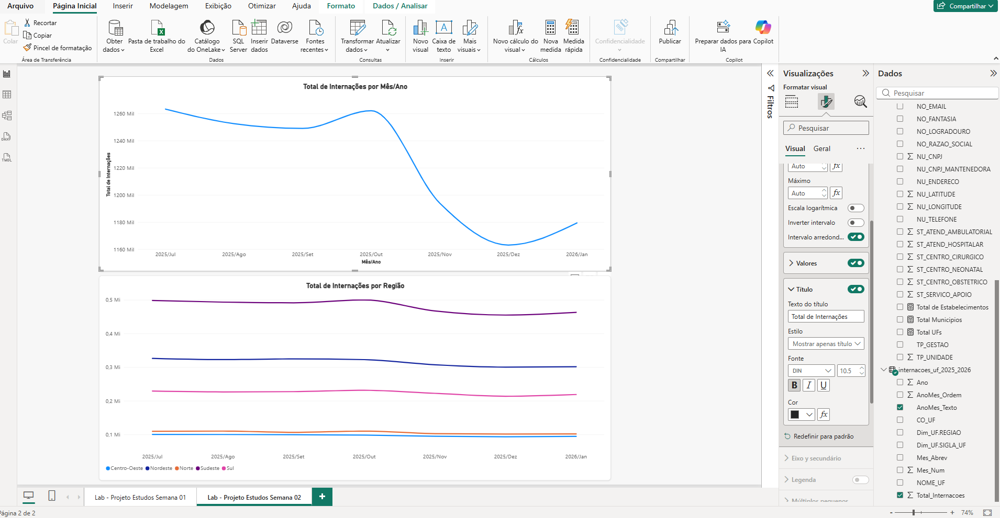

# 🏥 Power BI Roadmap — Saúde Pública

Roadmap de estudos em Power BI aplicado a dados públicos de saúde
do SUS/DATASUS — da interface básica da ferramenta até dashboards
analíticos, modelagem dimensional e DAX avançado.

## 🎯 Objetivo

Desenvolver habilidades profissionais em Business Intelligence
usando dados reais e abertos de saúde pública brasileira,
construindo um portfólio técnico complementar aos estudos de
Cybersecurity.

## 🗺️ Estrutura do Roadmap

| Semana | Foco                        | Projeto                       | Status |
|--------|-----------------------------|--------------------------------|--------|
| 01     | Fundamentos + dados         | Explorando dados do CNES       | ✅ Concluído |
| 02     | Power Query                 | Tratamento de dados de saúde   | ✅ Concluído |
| 03     | Modelagem                   | Modelo dimensional             | 🔜 |
| 04     | DAX                         | Indicadores de saúde           | 🔜 |
| 05     | Dashboards                  | Dashboard SUS                  | 🔜 |
| 06     | Power BI Service + projeto  | Projeto profissional           | 🔜 |

## 📊 Dashboard — Semana 01 (Panorama da Rede de Saúde)


Dashboard construído com dados do CNES Nacional (636 mil
estabelecimentos, 6 mil municípios, 27 UFs), incluindo KPIs,
distribuição geográfica por UF/Região, tipo de estabelecimento
e mapa do Brasil.

## 📊 Dashboard — Semana 02 (Internações Hospitalares SIH/SUS)



Dashboard construído com dados de Produção Hospitalar (SIH/SUS)
via TabNet/DATASUS, incluindo evolução mensal de internações no
Brasil e comparação entre as 5 regiões, com tratamento de
formato largo→longo (Unpivot) e correção de ordenação temporal.

## 🔧 Tecnologias

- Power BI Desktop
- Power Query (ETL)
- DAX
- Dados públicos: CNES / DATASUS / OpenDataSUS

## 📁 Estrutura de Pastas

```text
├── Semana-01/
│   └── README.md
├── Semana-02/ 
|   └── README.md
├── Semana-03/ (em breve)
└── README.md (este arquivo)
```
## 🔗 Fontes Oficiais

- [Portal de Dados Abertos do SUS](https://dadosabertos.saude.gov.br)
- [DATASUS](https://datasus.saude.gov.br)
- [OpenDataSUS](https://opendatasus.saude.gov.br)

