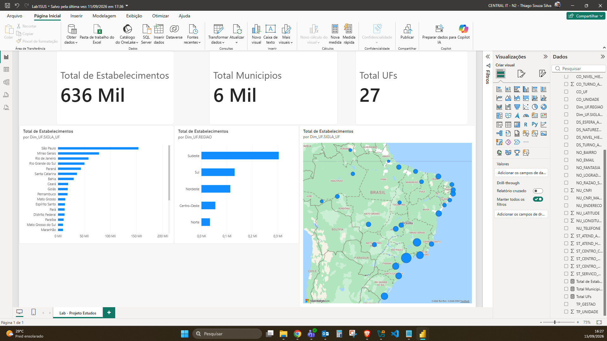
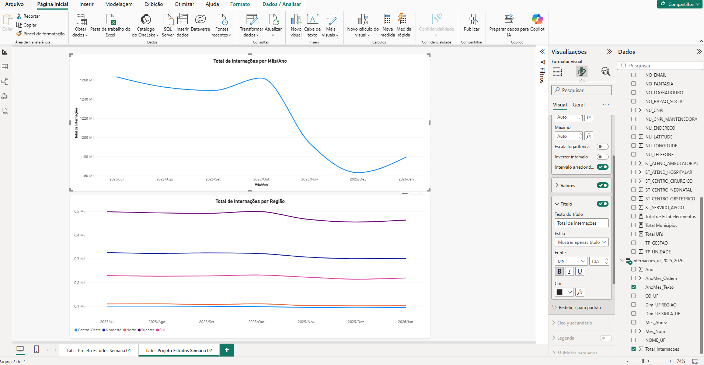
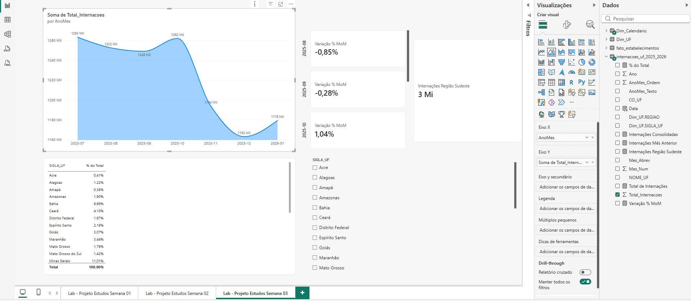
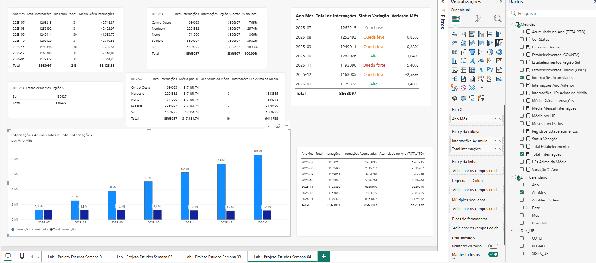

# 🏥 Power BI Roadmap — Saúde Pública

Roadmap de estudos em Power BI aplicado a dados públicos de saúde do SUS/DATASUS — da interface básica da ferramenta até dashboards analíticos, modelagem dimensional e DAX avançado.

## 🎯 Objetivo

Desenvolver habilidades profissionais em Business Intelligence usando dados reais e abertos de saúde pública brasileira, construindo um portfólio técnico complementar aos estudos de Cybersecurity.

## 🗺️ Estrutura do Roadmap

| Semana | Foco                        | Projeto                       | Status |
|--------|-----------------------------|--------------------------------|--------|
| 01     | Fundamentos + dados         | Explorando dados do CNES       | ✅ Concluído |
| 02     | Power Query                 | Tratamento de dados de saúde   | ✅ Concluído |
| 03     | Modelagem                   | Modelo dimensional             | ✅ Concluído |
| 04     | DAX                         | Indicadores de saúde           | ✅ Concluído |
| 05     | Dashboards                  | Dashboard SUS                  | 🔜 |
| 06     | Power BI Service + projeto  | Projeto profissional           | 🔜 |

## 📊 Dashboard — Semana 01 (Panorama da Rede de Saúde)



Dashboard construído com dados do CNES Nacional (636 mil estabelecimentos, 6 mil municípios, 27 UFs), incluindo KPIs, distribuição geográfica por UF/Região, tipo de estabelecimento e mapa do Brasil.

## 📊 Dashboard — Semana 02 (Internações Hospitalares SIH/SUS)



Dashboard construído com dados de Produção Hospitalar (SIH/SUS) via TabNet/DATASUS, incluindo evolução mensal de internações no Brasil e comparação entre as 5 regiões, com tratamento de formato largo→longo (Unpivot) e correção de ordenação temporal.

## 📊 Dashboard — Semana 03 (Time Intelligence & Modelagem SIH/SUS)



Dashboard focado em modelagem dimensional (Star Schema) com `Dim_Calendario` e métricas de Time Intelligence (`PREVIOUSMONTH`, Variação % MoM). Análise de comportamento de filtros explícitos via `CALCULATE` e tratamento de anomalias temporais em dados de produção do SUS.

## 📊 Dashboard — Semana 04 (DAX & Indicadores de Saúde)



Dashboard focado em DAX avançado e manipulação do contexto de filtro. Aplicação da função `CALCULATE` combinada com `ALL` e `FILTER`, criação de acumulados (`TOTALYTD`), médias diárias e mensais, cruzamento entre tabelas relativas com `RELATED`, e aplicação de regras de formatação condicional dinâmica com `SWITCH`.

## 🔧 Tecnologias

- Power BI Desktop
- Power Query (ETL)
- DAX
- Dados públicos: CNES / DATASUS / OpenDataSUS

## 📁 Estrutura de Pastas

```text
├── Semana-01/
│   └── README.md
├── Semana-02/ 
│   └── README.md
├── Semana-03/
│   └── README.md
├── Semana-04/
│   └── README.md
├── Semana-05/ (em breve)
├── Semana-06/ (em breve)
└── README.md (este arquivo)```
```
🔗 Fontes Oficiais

Portal de Dados Abertos do SUS
DATASUS
OpenDataSUS
